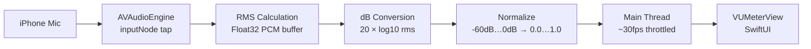

# Building a Vertical VU Meter for an iOS Camera App

A guide for implementing real-time audio level metering in a SwiftUI camera app using `AVAudioEngine`.

---

## Architecture Overview



| Component | File | Responsibility |
|-----------|------|----------------|
| **AudioMeterService** | `Services/AudioMeterService.swift` | Mic tap, RMS, dB, peak hold, route detection, gain |
| **VUMeterView** | `Views/Camera/VUMeterView.swift` | Vertical bar with gradient, peak indicator, mic icon |
| **CameraViewModel** | `ViewModels/CameraViewModel.swift` | Owns the service, exposes levels to the view |
| **CameraView** | `Views/CameraView.swift` | Overlays VUMeterView on the camera preview |
| **CameraLayout** | `Views/Camera/CameraLayout.swift` | Positioning constants |

---

## Why AVAudioEngine (and What Didn't Work)

> [!CAUTION]
> Two simpler approaches failed before we landed on `AVAudioEngine`. If you're building audio metering in a camera app, skip straight to the engine approach.

### ❌ Approach 1: AVCaptureAudioDataOutput

**Idea:** Add a second audio output to the `AVCaptureSession` and implement `AVCaptureAudioDataOutputSampleBufferDelegate`.

**Why it failed:** The capture session configures asynchronously on its own serial queue. By the time the metering service tries to attach (after the session reports "running"), calling `session.addOutput()` — even wrapped in `beginConfiguration`/`commitConfiguration` — silently fails or requires precise queue coordination that's fragile.

### ❌ Approach 2: Poll movieFileOutput Audio Channels

**Idea:** Read `AVCaptureAudioChannel.averagePowerLevel` and `.peakHoldLevel` from the `movieFileOutput`'s audio connection via a timer.

**Why it failed:** These properties only return meaningful data while the session is actively recording to a file. During preview (not recording), they return silence.

### ✅ Approach 3: AVAudioEngine Input Tap

**Idea:** Create a standalone `AVAudioEngine`, install a tap on `inputNode` (the microphone), and compute RMS from the raw PCM buffer.

**Why it works:**
- Runs 100% independently of `AVCaptureSession`
- No session reconfiguration or timing dependencies
- `AVAudioSession` configured with `.playAndRecord` + `.mixWithOthers` lets both coexist
- The tap delivers `AVAudioPCMBuffer` with Float32 channel data — direct access to samples

---

## Step 1: AudioMeterService

### Audio Session Setup

Configure `AVAudioSession` so the engine and capture session can share the mic:

```swift
let session = AVAudioSession.sharedInstance()
try session.setCategory(
    .playAndRecord,
    mode: .videoRecording,
    options: [.defaultToSpeaker, .allowBluetooth, .mixWithOthers]
)
try session.setActive(true)
```

> [!IMPORTANT]
> `.mixWithOthers` is critical — without it, starting the audio engine can interrupt the capture session.

### Install the Input Tap

```swift
let engine = AVAudioEngine()
let inputNode = engine.inputNode
let format = inputNode.outputFormat(forBus: 0)

// Buffer size 1024 ≈ 23ms at 44.1kHz — good balance of latency vs CPU
inputNode.installTap(onBus: 0, bufferSize: 1024, format: format) { [weak self] buffer, _ in
    self?.processBuffer(buffer)
}

try engine.start()
```

> [!WARNING]
> Always check `format.sampleRate > 0 && format.channelCount > 0` before installing the tap. An invalid format (e.g., no mic permission) will crash.

### RMS → dB → Normalized

```swift
func processBuffer(_ buffer: AVAudioPCMBuffer) {
    guard let channelData = buffer.floatChannelData else { return }
    let frameLength = Int(buffer.frameLength)
    let samples = channelData[0]  // Channel 0

    // 1. Compute RMS (Root Mean Square)
    var sumOfSquares: Float = 0.0
    for i in 0..<frameLength {
        let sample = samples[i]
        sumOfSquares += sample * sample
    }
    let rms = sqrtf(sumOfSquares / Float(frameLength))

    // 2. Convert to decibels
    let db: Float = rms > 0 ? 20.0 * log10f(rms) : -60.0

    // 3. Normalize -60dB…0dB → 0.0…1.0
    let level = (max(-60, min(db, 0)) + 60) / 60
}
```

### Peak Hold

Track the highest recent level and hold it for 1.5s before decaying:

```swift
if normalizedLevel > peakLevel {
    peakLevel = normalizedLevel
    peakTimestamp = now
} else if now - peakTimestamp > 1.5 {
    // Smooth decay toward current level
    peakLevel += (normalizedLevel - peakLevel) * 0.15
}
```

### Throttle UI Updates

The tap fires ~43 times/sec at 44.1kHz with 1024-sample buffers. Throttle to ~30fps to avoid overwhelming SwiftUI:

```swift
let shouldUpdate = (now - lastUIUpdate) >= (1.0 / 30.0)
if shouldUpdate {
    lastUIUpdate = now
    // Dispatch to main thread
}
```

### Thread Safety

The tap callback runs on an internal audio render thread. Use `NSLock` to protect mutable state (peakLevel, timestamps). Use a separate lock for callback closures (matching the pattern in `CameraService`).

### External Mic Detection

Monitor `AVAudioSession.routeChangeNotification` and check input port types:

```swift
let externalPorts: Set<AVAudioSession.Port> = [
    .headsetMic, .usbAudio, .bluetoothHFP, .bluetoothA2DP
]
let route = AVAudioSession.sharedInstance().currentRoute
let isExternal = route.inputs.first.map { externalPorts.contains($0.portType) } ?? false
let micName = route.inputs.first?.portName
```

### Gain Control

Hardware mic gain is controlled via `AVAudioSession`, not `AVCaptureDevice`:

```swift
let session = AVAudioSession.sharedInstance()
if session.isInputGainSettable {
    try session.setInputGain(clampedValue)  // 0.0 … 1.0
}
```

> [!NOTE]
> `isInputGainSettable` returns `false` on many devices. The gain slider should only appear when this is `true`.

---

## Step 2: VUMeterView (SwiftUI)

### Structure

```
VStack(spacing: 4)
├── 🎙 mic.fill icon (only when external mic)
└── ZStack (the meter bar)
    ├── Background track (semi-transparent)
    ├── Filled gradient bar (bottom → top)
    ├── Peak hold line (white, 2pt)
    └── dB tick marks (subtle)
```

### Three-Color Gradient

Map the standard VU meter zones:

```swift
LinearGradient(
    stops: [
        .init(color: Color(hex: "#34C759"), location: 0.0),   // Green: safe
        .init(color: Color(hex: "#34C759"), location: 0.6),   // Green ends at 60%
        .init(color: Color(hex: "#FFD60A"), location: 0.6),   // Yellow: warm
        .init(color: Color(hex: "#FFD60A"), location: 0.8),   // Yellow ends at 80%
        .init(color: Color(hex: "#FF3B30"), location: 0.8),   // Red: hot
        .init(color: Color(hex: "#FF3B30"), location: 1.0),   // Red to top
    ],
    startPoint: .bottom,
    endPoint: .top
)
```

### Fill from Bottom

Use `GeometryReader` to compute fill height:

```swift
GeometryReader { geo in
    let fillHeight = geo.size.height * CGFloat(level)
    
    Rectangle()
        .fill(gradient)
        .frame(height: fillHeight)
        .frame(maxHeight: .infinity, alignment: .bottom)
}
```

### Animation

```swift
.animation(.linear(duration: 0.05), value: level)  // Fast, smooth tracking
```

### Recording State Dimming

```swift
.opacity(isRecording ? 1.0 : 0.6)
.animation(.easeInOut(duration: 0.3), value: isRecording)
```

---

## Step 3: ViewModel Wiring

### Timing

> [!IMPORTANT]
> Start metering **after** the camera session reports running. The `onSessionRunningStateChanged` callback is the right trigger — not `onAppear`.

```swift
cameraService.onSessionRunningStateChanged = { [weak self] isRunning in
    guard let self else { return }
    self.isCameraReady = isRunning
    if isRunning && self.audioMeterService == nil {
        self.setupAudioMeter()
    }
}
```

### Setup

```swift
private func setupAudioMeter() {
    let meter = AudioMeterService()
    
    meter.onLevelsUpdated = { [weak self] average, peak in
        self?.audioLevel = average
        self?.audioPeak = peak
    }
    
    meter.onRouteChanged = { [weak self] isExternal, name in
        self?.isExternalMic = isExternal
        self?.externalMicName = name
    }
    
    meter.startMetering()
    meter.startMonitoringRoute()
    self.audioMeterService = meter
}
```

### Cleanup

```swift
func onDisappear() {
    audioMeterService?.stopMetering()
    audioMeterService?.stopMonitoringRoute()
}
```

---

## Step 4: Camera View Integration

Overlay the meter on the left edge of the camera preview inside the `ZStack`:

```swift
if viewModel.activeSheet == nil && !viewModel.showComposeSheet {
    let meterHeight = layout.previewSize.height * 0.35
    VUMeterView(
        level: viewModel.audioLevel,
        peak: viewModel.audioPeak,
        isExternalMic: viewModel.isExternalMic,
        isRecording: viewModel.isRecording
    )
    .frame(width: 50, height: meterHeight)
    .position(
        x: 30,  // Left edge inset
        y: layout.previewSize.height - meterHeight / 2 - 140  // Lower third
    )
}
```

**Visibility rules:**
- Hidden when any sheet is open
- Dimmed (60% opacity) when not recording
- Full opacity when recording

---

## Testing

### Unit-Testable: dB Normalization

```swift
func testNormalizeDecibels_silence_returnsZero() {
    XCTAssertEqual(AudioMeterService.normalizeDecibels(-60), 0.0, accuracy: 0.001)
}

func testNormalizeDecibels_fullScale_returnsOne() {
    XCTAssertEqual(AudioMeterService.normalizeDecibels(0), 1.0, accuracy: 0.001)
}

func testNormalizeDecibels_midRange() {
    XCTAssertEqual(AudioMeterService.normalizeDecibels(-30), 0.5, accuracy: 0.001)
}
```

### Manual Testing

- Speak into the mic → meter should respond in real-time
- Connect wired/BT headset → mic icon should appear
- Open a sheet → meter should disappear
- Start recording → meter should brighten to full opacity

---

## File Checklist

| Action | File | What to do |
|--------|------|------------|
| **CREATE** | `Services/AudioMeterService.swift` | AVAudioEngine tap, RMS, route, gain |
| **CREATE** | `Views/Camera/VUMeterView.swift` | SwiftUI vertical bar with gradient |
| **CREATE** | `Tests/AudioMeterServiceTests.swift` | dB normalization tests |
| **MODIFY** | `Services/CameraServiceProtocol.swift` | Add `audioDevice: AVCaptureDevice?` |
| **MODIFY** | `Services/CameraService.swift` | Store `audioDevice` as property |
| **MODIFY** | `ViewModels/CameraViewModel.swift` | Own AudioMeterService, expose levels |
| **MODIFY** | `Views/CameraView.swift` | Overlay VUMeterView in ZStack |
| **MODIFY** | `Views/Camera/CameraLayout.swift` | Add meter dimension constants |
| **MODIFY** | `Tests/MockCameraService.swift` | Add `audioDevice` stub |
