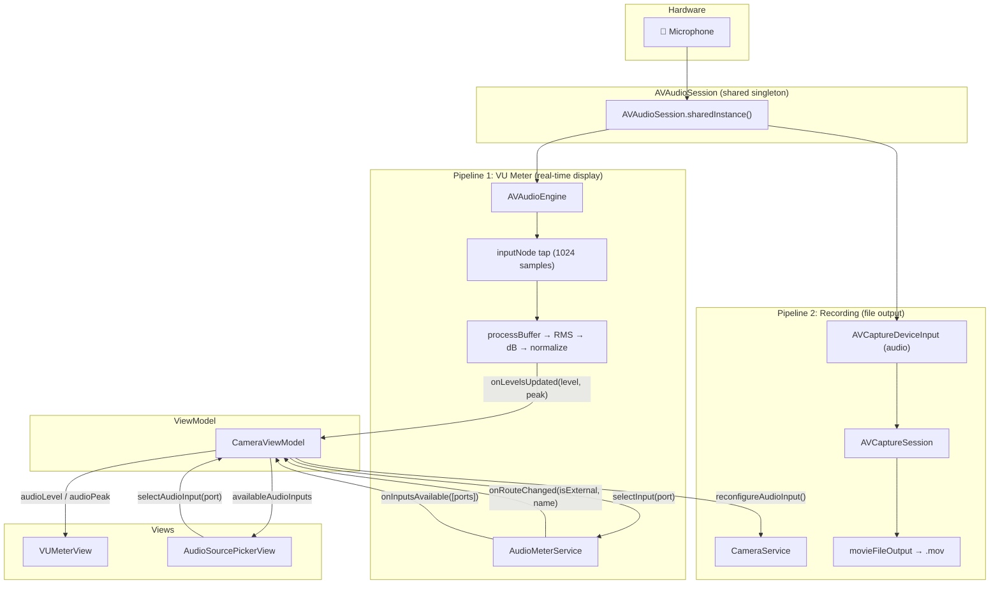

# VU Meter & Audio Input System — Architecture Review

> **Last updated**: June 17, 2026
> **Scope**: Real-time audio metering, source detection, hot-swap, and recording sync

---

## System Overview

The VU meter and audio input system spans **5 files** across 3 layers:

| Layer         | File                                                                                                                                         | Responsibility                                                        |
| ------------- | -------------------------------------------------------------------------------------------------------------------------------------------- | --------------------------------------------------------------------- |
| **Service**   | [AudioMeterService.swift](file:///Users/rodczaro/Desktop/00-Vibecode/promptcam-fixer/PromptCam/Services/AudioMeterService.swift)             | AVAudioEngine tap, RMS computation, route monitoring, input selection |
| **Service**   | [CameraService.swift](file:///Users/rodczaro/Desktop/00-Vibecode/promptcam-fixer/PromptCam/Services/CameraService.swift)                     | AVCaptureSession audio input hot-swap (`reconfigureAudioInput`)       |
| **ViewModel** | [CameraViewModel.swift](file:///Users/rodczaro/Desktop/00-Vibecode/promptcam-fixer/PromptCam/ViewModels/CameraViewModel.swift)               | Bridges service callbacks → published UI state                        |
| **View**      | [VUMeterView.swift](file:///Users/rodczaro/Desktop/00-Vibecode/promptcam-fixer/PromptCam/Views/Camera/VUMeterView.swift)                     | Vertical bar with gradient fill, peak hold, hash marks, source icon   |
| **View**      | [AudioSourcePickerView.swift](file:///Users/rodczaro/Desktop/00-Vibecode/promptcam-fixer/PromptCam/Views/Camera/AudioSourcePickerView.swift) | Modal overlay for choosing between available mics                     |

---

## Architecture Diagram



> [!IMPORTANT]
> The two pipelines share `AVAudioSession.sharedInstance()`. You must **never** call `setActive(false)` from `AudioMeterService` — doing so kills `AVCaptureSession`'s audio connection and silences recordings.

---

## Component Deep-Dive

### 1. AudioMeterService

**File**: [AudioMeterService.swift](file:///Users/rodczaro/Desktop/00-Vibecode/promptcam-fixer/PromptCam/Services/AudioMeterService.swift) (484 lines)

#### Audio Engine & Metering

| Concept          | Implementation                                                                 | Lines                                                                                                                                                                                                                              |
| ---------------- | ------------------------------------------------------------------------------ | ---------------------------------------------------------------------------------------------------------------------------------------------------------------------------------------------------------------------------------- |
| Engine setup     | `AVAudioEngine()` → `inputNode.installTap(bufferSize: 1024)`                   | [L126–L155](file:///Users/rodczaro/Desktop/00-Vibecode/promptcam-fixer/PromptCam/Services/AudioMeterService.swift#L126-L155)                                                                                                       |
| RMS computation  | `Σ(sample²) / N → √ → 20·log₁₀(rms)` on channel 0                              | [L196–L210](file:///Users/rodczaro/Desktop/00-Vibecode/promptcam-fixer/PromptCam/Services/AudioMeterService.swift#L196-L210)                                                                                                       |
| dB normalization | Maps `[-60, 0]` dB → `[0.0, 1.0]`                                              | [L100–L103](file:///Users/rodczaro/Desktop/00-Vibecode/promptcam-fixer/PromptCam/Services/AudioMeterService.swift#L100-L103)                                                                                                       |
| Peak hold        | New level > peak → update; after 1.5s → decay at 0.15 blend                    | [L217–L224](file:///Users/rodczaro/Desktop/00-Vibecode/promptcam-fixer/PromptCam/Services/AudioMeterService.swift#L217-L224)                                                                                                       |
| UI throttle      | Publishes at 30 fps max via `CACurrentMediaTime` comparison                    | [L228–L231](file:///Users/rodczaro/Desktop/00-Vibecode/promptcam-fixer/PromptCam/Services/AudioMeterService.swift#L228-L231)                                                                                                       |
| Thread safety    | `stateLock` (NSLock) protects peak/timestamp; `callbackLock` protects closures | [L40](file:///Users/rodczaro/Desktop/00-Vibecode/promptcam-fixer/PromptCam/Services/AudioMeterService.swift#L40), [L66](file:///Users/rodczaro/Desktop/00-Vibecode/promptcam-fixer/PromptCam/Services/AudioMeterService.swift#L66) |

#### Route Change Handling

```
routeChangeNotification
    ↓
handleRouteChange(reason)
    ├─ .newDeviceAvailable  → autoSelectExternalInput() → evaluateCurrentRoute() → restartEngineWithSessionReset()
    ├─ .oldDeviceUnavailable → autoSelectBuiltInInput() → evaluateCurrentRoute() → restartEngineWithSessionReset()
    ├─ .override / .routeConfigurationChange → evaluateCurrentRoute() → restartEngineWithSessionReset()
    └─ default → evaluateCurrentRoute() (no restart)
```

- **Auto-selection**: [autoSelectExternalInput()](file:///Users/rodczaro/Desktop/00-Vibecode/promptcam-fixer/PromptCam/Services/AudioMeterService.swift#L306-L321) scans `availableInputs` for external port types, calls `setPreferredInput`. [autoSelectBuiltInInput()](file:///Users/rodczaro/Desktop/00-Vibecode/promptcam-fixer/PromptCam/Services/AudioMeterService.swift#L325-L346) finds `.builtInMic` and sets it as preferred.
- **Debounced restart**: 800ms delay collapses rapid notifications into one restart. [L355–L375](file:///Users/rodczaro/Desktop/00-Vibecode/promptcam-fixer/PromptCam/Services/AudioMeterService.swift#L355-L375)
- **No session cycling**: Engine teardown + fresh `AVAudioEngine()` — the new `inputNode` automatically binds to the preferred input.

#### Interruption Recovery

[handleInterruption()](file:///Users/rodczaro/Desktop/00-Vibecode/promptcam-fixer/PromptCam/Services/AudioMeterService.swift#L377-L394): On `.ended`, calls `setActive(true)` then `restartEngine()` with 500ms debounce.

#### External Port Types

Defined at [L29–L34](file:///Users/rodczaro/Desktop/00-Vibecode/promptcam-fixer/PromptCam/Services/AudioMeterService.swift#L29-L34):

```swift
.headsetMic, .usbAudio, .bluetoothHFP, .bluetoothA2DP
```

---

### 2. CameraService — Audio Input Hot-Swap

**Method**: [reconfigureAudioInput()](file:///Users/rodczaro/Desktop/00-Vibecode/promptcam-fixer/PromptCam/Services/CameraService.swift#L248-L292)

Syncs the **recording** pipeline to the same mic the VU meter is monitoring:

```
sessionQueue.async {
    guard !movieFileOutput.isRecording     // no-op during recording
    guard newDevice.uniqueID != current    // skip if unchanged
    session.beginConfiguration()
    session.removeInput(oldInput)           // remove old AVCaptureDeviceInput
    session.addInput(newInput)              // add new one matching preferred input
    session.commitConfiguration()
}
```

> [!WARNING]
> This is a **no-op during active recording** to avoid corrupting the `.mov` file. If the user hot-swaps a mic mid-recording, the recording continues on the original mic until stopped.

---

### 3. CameraViewModel — Wiring

**Audio properties**: [L108–L127](file:///Users/rodczaro/Desktop/00-Vibecode/promptcam-fixer/PromptCam/ViewModels/CameraViewModel.swift#L108-L127)

| Property                | Type                              | Source                                         |
| ----------------------- | --------------------------------- | ---------------------------------------------- |
| `audioLevel`            | `Float`                           | `onLevelsUpdated` callback                     |
| `audioPeak`             | `Float`                           | `onLevelsUpdated` callback                     |
| `isExternalMic`         | `Bool`                            | `onRouteChanged` callback                      |
| `activeAudioInputName`  | `String?`                         | `onRouteChanged` / `onInputsAvailable`         |
| `availableAudioInputs`  | `[AVAudioSessionPortDescription]` | `onInputsAvailable` callback                   |
| `showAudioSourcePicker` | `Bool`                            | Set `true` when `activeAudioInputName` changes |

**Picker trigger logic** ([onRouteChanged callback](file:///Users/rodczaro/Desktop/00-Vibecode/promptcam-fixer/PromptCam/ViewModels/CameraViewModel.swift#L491-L507)):

```swift
let micChanged = name != self.activeAudioInputName
if micChanged && self.audioMeterService != nil {
    self.showAudioSourcePicker = true            // show picker
    self.cameraService.reconfigureAudioInput()   // sync recording pipeline
}
```

**Manual selection** ([selectAudioInput](file:///Users/rodczaro/Desktop/00-Vibecode/promptcam-fixer/PromptCam/ViewModels/CameraViewModel.swift#L530-L537)):

```swift
audioMeterService?.selectInput(port)         // sets preferred + restarts engine
cameraService.reconfigureAudioInput()         // syncs capture session
```

---

### 4. VUMeterView

**File**: [VUMeterView.swift](file:///Users/rodczaro/Desktop/00-Vibecode/promptcam-fixer/PromptCam/Views/Camera/VUMeterView.swift) (158 lines)

#### Layout

| Element          | Size / Position                        |
| ---------------- | -------------------------------------- |
| Total frame      | `50pt × 28%` of preview height         |
| Bar width        | 55% of frame width (~27pt)             |
| dB labels        | Right 45% of frame                     |
| Source icon      | 14pt, centered above bar               |
| Bottom alignment | Aligned with record button bottom edge |

#### Visual Stack (ZStack, bottom-up)

1. **Source icon**: `iphone.gen3.radiowaves.left.and.right` (built-in, secondary text) or `mic.fill` (external, purple)
2. **Background track**: `panelBg.opacity(0.3)`, 4pt corner radius
3. **Level fill**: Three-stop `LinearGradient` rising from bottom
   - Bottom 60%: Green (`#c734b6`)
   - 60–80%: Yellow (`#0a99ff`)
   - Top 20%: Red (`#FF3B30`)
4. **Peak hold**: 2pt horizontal line in accent color, holds 1.5s then decays
5. **Hash marks + labels**: At 0, -6, -12, -20, -30, -40 dB positions

#### Animations

- Level: `.linear(duration: 0.05)` — smooth 50ms transitions
- Recording state: `.easeInOut(duration: 0.25)`
- External mic icon: `.easeInOut(duration: 0.3)`

#### Tap Target

Full frame via `.contentShape(Rectangle())` → opens `AudioSourcePickerView`

---

### 5. AudioSourcePickerView

**File**: [AudioSourcePickerView.swift](file:///Users/rodczaro/Desktop/00-Vibecode/promptcam-fixer/PromptCam/Views/Camera/AudioSourcePickerView.swift) (134 lines)

- **Trigger**: Screen dims 10%, panel scales in at 0.95
- **Content**: Header ("Audio Source Detected") + scrollable list of available inputs
- **Per-row**: Icon (contextual SF Symbol) + port name + type label + checkmark if active
- **Active highlight**: Accent color background at 10% opacity
- **Dismissal**: Tap × button, tap outside scrim, or select an input

#### Icon mapping

| Port Type             | Icon              |
| --------------------- | ----------------- |
| `.builtInMic`         | `iphone`          |
| `.headsetMic`         | `headphones`      |
| `.usbAudio`           | `cable.connector` |
| `.bluetoothHFP/.A2DP` | `wave.3.right`    |
| Other                 | `mic.fill`        |

---

## Data Flow Summary

```
┌─────────────────────────────────────────────────────────────┐
│  Mic plugged in                                             │
│    ↓                                                        │
│  routeChangeNotification (.newDeviceAvailable)              │
│    ↓                                                        │
│  autoSelectExternalInput() → setPreferredInput(usbMic)      │
│    ↓                                                        │
│  evaluateCurrentRoute() → onRouteChanged(true, "USB Mic")   │
│    ↓                                                        │
│  CameraViewModel:                                           │
│    • showAudioSourcePicker = true  (picker appears)         │
│    • cameraService.reconfigureAudioInput()                  │
│    ↓                                                        │
│  restartEngineWithSessionReset() [800ms debounce]           │
│    ↓                                                        │
│  tearDownEngine() → startMetering() → evaluateCurrentRoute()│
│    ↓                                                        │
│  VU meter shows levels from new mic                         │
│  Recording will use new mic (via capture session swap)      │
└─────────────────────────────────────────────────────────────┘
```

---

## Improvement Opportunities

### High Priority

> [!IMPORTANT]
> **1. Gradient colors are swapped**
> In [VUMeterView.swift L30–L32](file:///Users/rodczaro/Desktop/00-Vibecode/promptcam-fixer/PromptCam/Views/Camera/VUMeterView.swift#L30-L32), `vuGreen` is `#c734b6` (magenta) and `vuYellow` is `#0a99ff` (blue). These appear to be custom brand colors but the variable names are misleading. Either rename the variables to match the actual colors or use the original green/yellow values.

> [!IMPORTANT]
> **2. Mid-recording mic swap is silently ignored**
> [reconfigureAudioInput()](file:///Users/rodczaro/Desktop/00-Vibecode/promptcam-fixer/PromptCam/Services/CameraService.swift#L251-L253) is a no-op during recording. The user gets no feedback that their mic swap didn't apply to the recording. Consider showing a warning banner (similar to the format-locked warning) that says "Stop recording to switch audio source." (Losing an External Mic Source while recording Should Pop a Visable Warning so the user addressed the issue. It could be a mechnical issue like the mic disconnected from the device physically. )

> [!IMPORTANT]
> **3. `restartEngine()` vs `restartEngineWithSessionReset()` inconsistency**
> Two restart methods exist with different debounce delays:
>
> - [restartEngine()](file:///Users/rodczaro/Desktop/00-Vibecode/promptcam-fixer/PromptCam/Services/AudioMeterService.swift#L178-L192): 500ms delay, used only by `handleInterruption`
> - [restartEngineWithSessionReset()](file:///Users/rodczaro/Desktop/00-Vibecode/promptcam-fixer/PromptCam/Services/AudioMeterService.swift#L355-L375): 800ms delay, used by route changes and `selectInput`
>
> These do the same thing now (session cycling was removed). **Consolidate into one method** with a configurable delay, or always use 800ms.

### Medium Priority

> [!WARNING]
> **4. `handleInterruption` still calls `setActive(true)` directly**
> At [L386](file:///Users/rodczaro/Desktop/00-Vibecode/promptcam-fixer/PromptCam/Services/AudioMeterService.swift#L386), `setActive(true)` is called after an interruption ends. This is necessary for interruption recovery but should be documented as the **only** safe place to call `setActive` — otherwise it risks the same regression as the session cycling bug.

> [!WARNING]
> **5. `processBuffer` uses scalar loop — could use Accelerate**
> The RMS calculation at [L201–L208](file:///Users/rodczaro/Desktop/00-Vibecode/promptcam-fixer/PromptCam/Services/AudioMeterService.swift#L201-L208) iterates sample-by-sample. For larger buffers, `vDSP_measqv` + `vDSP_meanv` from the Accelerate framework would be faster and use SIMD. At 1024 samples this is unlikely to matter, but it's a clean improvement.

> [!WARNING]
> **6. `evaluateCurrentRoute()` dispatches twice to main**
> At [L468–L480](file:///Users/rodczaro/Desktop/00-Vibecode/promptcam-fixer/PromptCam/Services/AudioMeterService.swift#L468-L480), two separate `DispatchQueue.main.async` blocks fire for `onRouteChanged` and `onInputsAvailable`. These could be coalesced into a single dispatch to reduce overhead and ensure both callbacks see the same snapshot.

### Low Priority

**7. No `.externalAccessory` in external ports**
The `externalMicPorts` set doesn't include `.externalAccessory` (Lightning/MFi audio devices). Some pro mic interfaces use this port type.

**8. `isGainAvailable` ignores the `device` parameter**
[isGainAvailable(for:)](file:///Users/rodczaro/Desktop/00-Vibecode/promptcam-fixer/PromptCam/Services/AudioMeterService.swift#L412-L414) takes a `device` parameter but only checks `AVAudioSession.isInputGainSettable`. The parameter could be removed, or the method could also check `device?.isExposureModeSupported` for completeness.

**9. Peak decay blend factor is hardcoded**
The `0.15` blend factor at [L223](file:///Users/rodczaro/Desktop/00-Vibecode/promptcam-fixer/PromptCam/Services/AudioMeterService.swift#L223) controls how fast the peak indicator drops. This could be a named constant for tuning.

**10. Picker auto-dismiss timeout**
Currently the picker stays open until the user interacts. Consider adding a 10–15 second auto-dismiss so it doesn't block the camera if the user doesn't notice it.
